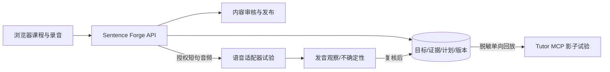

# MCP 与语音能力选型：接入决策和验证合同

2026-09-30｜PRD v1.1 附件｜公开资料核验；**未安装或端到端实测候选组件**

本文件是 [00 总导航](00-总PRD导航与开发路径.md) 的选型附件，服务于 [13 产品 PRD](13-完整产品PRD-需求与验收.md) 的 R02、R06、R07 与 [15 实施合同](15-可直接开发的实施合同.md) 的 W2、W5。它固定开发者该评估哪个 MCP、如何接、何时才可进入正式学习路径。外部版本、许可与工具清单执行前必须重新核对。

## 1. 明确决策

**首版正式学习路径由本项目保存能力目标、学习证据和下一课决策，不把第三方 MCP 当权威状态。** 当前公开候选没有一个同时提供完整英语目标图、针对本用户的四技能诊断、可信口语评价和可直接嵌入产品的浏览器界面。MCP 是工具接入协议，不自动带来教学效度。

|用途与阶段|具体选型|当前决定|升级门槛|
|---|---|---|---|
|能力图、诊断、下一课；W0–W3|本项目 `objective_versions`、`evidence_events`、`plan_decisions` 与 [15](15-可直接开发的实施合同.md) 的规则|必做；唯一正式状态|通过 T1–T4 后按真实反馈调整|
|调度算法对照；W2 后|[Tutor MCP](https://github.com/ArnaudGuiovanna/tutor-mcp)，评估锁定 v0.6.1|隔离影子回放，不写正式学习状态|第 3 节对照过关，再做架构评审|
|短句跟读反馈；W5|[mcp-server-pronunciation](https://github.com/JuhongPark/mcp-server-pronunciation)，v0.3.0|本地实验，不用于掌握认证|第 4 节真人对照过关，音频桥接和隐私落实|
|产品内短句发音；W5|[Azure Speech SDK Pronunciation Assessment](https://learn.microsoft.com/en-us/azure/ai-services/speech-service/how-to-pronunciation-assessment)，先限 en-US 有稿短句|首个商业 API 适配器候选，**不是 MCP**|试产质量、费用、数据条件过关|
|Azure 官方 Speech MCP|[官方工具列表](https://learn.microsoft.com/en-us/azure/developer/azure-mcp-server/tools/ai-services-speech)|不用于发音评测；目前只列 STT/TTS|官方若增加评测工具再复核|
|自由口述、课堂互动、写作及全能力认证|无现成 MCP 被选为评分权威|按项目任务量表、证据及复核链实现|通过 A6/A9/A10 的真实任务验证|

这里“选型”不是安装或采购。当前开发会话中未发现可调用的 Tutor 或发音 MCP；公开仓库可访问不等于本机服务可用。本轮没有运行基准、中文母语者录音实测或成本测量。

## 2. 系统边界和接线

Tutor MCP 需要后台 MCP 客户端和独立运行进程，不是 React 组件或现成 HTTP 业务接口。试验记录输入快照、工具调用、输出、版本、耗时与错误。**禁止在正式答题时双写 Tutor 与本项目数据库，禁止用 Tutor 的掌握率覆盖分技能证据。**

本地发音 MCP 默认操作其运行机器的麦克风；NAS/服务器麦克风不是用户浏览器麦克风。MCP Apps 面板的 WAV 上传能力也不能直接嵌入当前 React 页面。产品须先按 [15](15-可直接开发的实施合同.md) 的 `/oral` 合同完成浏览器录音、回放、账户校验、限额、上传与删除；插件接在后端音频适配器之后。任何第三方传输须明确范围和用途。

## 3. Tutor MCP：具体调用与影子对照

[安装说明](https://github.com/ArnaudGuiovanna/tutor-mcp/blob/main/docs/installation.md)列出 v0.6.1、单人本地 SQLite/stdio 等运行方式；[工具清单](https://github.com/ArnaudGuiovanna/tutor-mcp/blob/main/docs/mcp-tools.md)列出 `init_domain`、`add_concepts`、`get_curriculum_snapshot`、`validate_domain_graph`、`start_learning_session`、`get_next_activity`、`prepare_assessment_attempt`、`submit_assessment_attempt`、`record_interaction`、`get_olm_snapshot`、`get_decision_replay_summary`。评估的是图约束、学习状态与决策回放，不是“英语大师地图”。其[算法说明](https://github.com/ArnaudGuiovanna/tutor-mcp/blob/main/docs/algorithms.md)承认 BKT 参数须经验校准，生成难度不是实测答对概率；[学习完整性说明](https://github.com/ArnaudGuiovanna/tutor-mcp/blob/main/docs/learning-integrity.md)区分估计、保持、展示与迁移。

**输入**：只导入 W1 已核验的首批原子目标和前置；使用 [14](14-首条端到端旅程与分流规格.md) 的“基础已会”“文字会声音卡”“理解会口述卡”三种画像，再加入坏字幕、ASR 错误、提示后答对、已斩掉基础重现等 T2–T4 事件。先用合成或授权的去标识文本，不导入个人录音。

**输出记录**：在隔离的 `shadow_runs` 中存 `mapVersion`、证据快照哈希、Tutor 版本、调用链、下一目标、活动建议、理由、不确定性、耗时与人工审阅结论；与本项目规则规划器对同一输入并排比较，重复运行检查可回放性。

**准入**：三种画像及全部故障 fixture 均不得违反 [13](13-完整产品PRD-需求与验收.md) A2/A3/A5/A6；不能因错转写降级，也不能强迫已会基础重刷；专家能指明至少一种规则基线做不到而 Tutor 稳定改善的决策；数据隔离、时延、维护成本可接受。未过则仅保留研究。即便过关，也只考虑封装为**只读、可拒绝的建议**，不得整体迁移能力图或历史学习状态。fixture 是工程验收，不是学习效果的统计证明。必须交一份带输入、输出、分歧和采纳理由的评估报告，不能只因项目用了 BKT/FSRS 就宣称更智能。

## 4. 语音任务与供应商能力的对应

|任务|推荐试验|不能从结果推断|
|---|---|---|
|原声音频理解|播放器、校对稿、陌生理解题|STT 成功不等于用户听懂|
|短句跟读|本地发音 MCP v0.3.0 与 Azure Speech SDK 朗读型评测对照|读准不等于脱稿回应|
|45–90 秒自由复述|站内录音、可纠错转写、内容/关系/组织量表、真人抽样|ASR 准确率和发音分不等于语义正确|
|即时课堂互动|未知追问、澄清和修复任务，逐轮证据|单次模型分数不等于真实交际掌握|

[本地发音 MCP 仓库](https://github.com/JuhongPark/mcp-server-pronunciation)的 v0.3.0 提供 `practice`、`retry`、`assess`、`analyze_uploaded_audio` 等；本地 Whisper 与可选音素组件有资源需求。[已知限制](https://github.com/JuhongPark/mcp-server-pronunciation#known-limitations)说明反馈实验性、Whisper 可能误听、韵律有启发式成分，且韩语母语提示不可直接用于本用户。[基准说明](https://github.com/JuhongPark/mcp-server-pronunciation/blob/main/docs/BENCHMARKS.md)显示 Speechocean 适配器只解析元数据，尚未跑 ASR/发音评分基准。W5 用 20–30 条有使用权的短句样本作为**试验设计**，覆盖自然中文母语口音、含噪、快慢、专有名词和故意误读；真人盲评建议是否指出可听问题、是否误伤可理解表达。样本数不是现有成绩。使用个人声音须先确定录音数据方案。

[Azure 官方 Speech MCP 说明](https://learn.microsoft.com/en-us/azure/developer/azure-mcp-server/azure-services/azure-mcp-speech-foundry-tools)和[工具列表](https://learn.microsoft.com/en-us/azure/developer/azure-mcp-server/tools/ai-services-speech)只列 `speech stt recognize` 和 `speech tts synthesize`，**不可列为发音评测 MCP**。商品级基线试验对象是 [Azure Speech SDK Pronunciation Assessment](https://learn.microsoft.com/en-us/azure/ai-services/speech-service/how-to-pronunciation-assessment)；先限 en-US 有稿短句，分数只作练习反馈。其[官方限制](https://learn.microsoft.com/en-us/azure/foundry/responsible-ai/speech-service/pronunciation-assessment/characteristics-and-limitations-pronunciation-assessment)列出录音质量、识别与多人场景问题；[短音频 REST 文档](https://learn.microsoft.com/en-us/azure/ai-services/speech-service/rest-speech-to-text-short)的发音评估有 30 秒限制，不能直接承接 45–90 秒复述。自由口述要另做 SDK/长音频、语义反馈及费用试验。

持久化至少记录 `audioAssetId`、录制条件、参考文本版本、ASR/评测模型版本、原始指标、可修正转写、给用户的反馈、置信/争议、人审结论及证据用途。**ASR 词错不能自动解释成用户发音错。** 修正转写时保留原版，不改写原始尝试。短句发音、自由表达和互动分别保留证据，不得互相兑换掌握状态。

## 5. 开发任务、回退与未决事项

1. W0/W1 固定本项目为唯一状态真源；建立语音适配器边界及影子回放格式。不因评估 MCP 阻塞目标图工作。
2. W2 后锁定 Tutor 版本，跑第 3 节对照并交可审阅报告。生成/推荐均不得绕过来源、答案、重复、音频及独立留出题质量门。
3. W5 前先跑通站内录音链路，再分别试本地 MCP 与 Azure SDK；不能把服务器麦克风试验当产品功能。确定录音触发、传输、留存/删除、费用上限和不可用回退。
4. W5 验收同时检查跟读、自由复述和互动；故意制造转写错误时不降级。供应商不可用则保留录音待复核，不用文本相似度伪造成功。
5. 使用付费服务或上传个人声音前，向用户提供具体数据流、费用估算和替代路径；执行人员不能默默更换供应商或同名 MCP。

本轮只核验官方仓库/文档所列能力与限制，**未**验证 Windows/NAS 实装、响应时间、真人评分一致性、Azure 账号和实际价格、个人数据处理许可、学习效果。真正的课程价值仍由 [13](13-完整产品PRD-需求与验收.md) A10 的等条件陌生任务前后测裁定。

