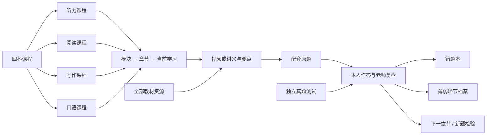

> 首页入口与进度/个人档案以[57最新合同](57-首页Dashboard与个人学习档案合同.md)为准；本文其余领域合同继续适用。

# 56 · 四科课程系统 PRD 修订与样板扩建合同
2026-10-03｜产品基线 v1.1｜替换55以“今天题组”为主入口的结构；保留其判题、证据、版本、数据安全合同。仅设计和样板，未部署正式应用。

## 1. 课程到底解决什么
从“今天做几个题”转为“有结构地学一种方法，在真题中运用，让老师解释本人遇到的问题，再回到课程往前走”。每科有完整目录、当前位置和阶段目标，内容不依赖答错才出现。本人通常完整看视频，可倍速；也可直接读讲义和精华解析。两种路径都进入同一配套实践，而不是两套互相重复的课。
四科分开做样板，不能一条听力题链换配色就叫四科课程；难度与内容扩展须依照该科方法及实际反馈。课程进度给位置感，原始作答和新题给能力证据，二者不相互冒充。

## 2. 主导航与站点地图
结构源文件：[site-map.json](toefl-demo-v2/site-map.json)。预览：[样板课程](toefl-demo-v2/index.html)。

左侧固定：四科课程、独立真题测试、错题本、薄弱环节、资料库。中间：所选科目的模块与章节列表、状态和进度。右侧：面包屑、当前章、学习/配套真题/复盘三页签。老师是当前章节的面板，不另起失去上下文的聊天首页。
宽屏三栏；老师展开后使用内容区内的抽屉或下方区块，不能压缩原文到难读。手机通过科目→目录→内容逐级进入，有返回和同一面包屑；不是把三栏缩小。
“今天”作为继续上次学习的快捷动作，不再成为吞掉科目和课程体系的唯一入口。

## 3. 四科模块的完整范围
| Part | 模块路径 | 专项训练 |
|---|---|---|
| 听力 | 导学与首听 → 声音识别/语块 → 一句回应 → 对话 → 公告 → 学术谈话 → 限时综合 | 词义/听辨/关系保持/语用分别补练；不强制每题全文听写 |
| 阅读 | 导学与线索 → 词形/搭配填词 → 日常文本 → 长句 → 词义/推断/修辞 → 篇章结构 → 限时综合 | 日常定位和学术理解不同；主干解释服务题意，不为拆句而拆句 |
| 写作 | 导学与表达组织 → 原词块组句 → 邮件任务 → 讨论观点与贡献 → 论证方法 → 修改与限时 | 先目的/要求再语言；本人修改，AI代写另标 |
| 口语 | 导学 → 发音/意群/记忆 → 听后重复 → 采访直答 → 理由/例子/经历/条件 → 无稿限时 | 重复准确性和采访组织两套出口；不能同义改写算原句准确复述 |

模块覆盖当前12类任务及共同语言基础；词汇/听口/阅写基础作为四科可引用的补课，不额外变成第五个必修Part。
模块之下的教学章节根据讲义和视频内容形成，可合并多段视频、也可拆长章。视频文件数不自动等于学习章节数。保留教师原始目录，同时建立教学目录，映射需要验收后发布。
本轮四科各做一个代表章节。其余章节是规划目录，不宣称已写完。当前题例并非最终难度上限，后续每模块需要简单定位到嵌套/篇章/复杂输出递进及未见检验。

## 4. 样板房合同
每科样板必须包含：
1. “学会什么”和本章在模块里的位置。
2. 原教师视频入口、倍速、最后位置；讲义原页、可快速读的方法解释，两条可选学习路径。
3. 可核对的配套原题及来源，提交前不显答案；可直接挑战，不强制看课。
4. 保存本人作答，按科目组织复盘。闭题以核验答案/原文判，开放题以实际回答和量表辅助解释。
5. 错误入错题本、错因先标假设；用户可记“不会/猜对/太慢/不知道为何对”，不能只收答错。
6. 本章活动完成与待验证能力分开；下一章节、新题检验、回看课程都能返回准确位置。

样板完成不表示AI、持久化、所有资料入库已经完成。原型必须在页面说明实际反馈来源，不能把预设说明演成针对本人录音的AI分析。本人确认样板后，Zcode才按合同扩建。

## 5. 四种进度，分别解释
- **课程完成率** = 已完成必需活动 / 当前发布版本全部必需活动。每章默认3活动：方法学习、配套题提交、复盘记录完成。具体章可配置，不一律3。方法看视频或读讲义是OR关系，不重复加分。
- **视频观看覆盖** = 实际观看区间并集 / 视频总时长。倍速按媒体时间计，拖到末尾不算看完。保存位置不等于覆盖。本人标记看完保留“自报”字段。
- **目录推进** = 已完成章节 / 本人当前课程版本章节总数。未发布规划章另标，不能把全部规划章假装可学习。
- **能力证据** = 不同新题、无提示、跨日的独立表现及输出片段。不直接给总掌握百分比；数据不足就说还需检查。

必须在百分比附近写范围和分母，如“样板课程：1/3活动，33%”。不能把样板完成显示为阅读全科完成100%。本轮原型全科仍在编排，只展示样板活动进度和原始教师视频目录数量。
目录版本冻结在开始学习时；添加章说明分母变化并保留历史，不让完成率无解释下降。免修与完成分别计数，可显示已处理（完成+免修）；不能暗中把免修当观看或掌握。
复盘“已经理解”是本人确认，而非模型验收；AI不可用可保留待复盘或本人写总结完成学习活动，但能力仍待检查。

## 6. 所有资料怎样利用
[资源映射](toefl-demo-v2/resource-catalog.json)由既有清单生成，包括8份核心讲义和206段视频快照。127段四科精讲、48词汇、17听口基础、14阅写基础；分类数量由清单计算，不代表内容审签。
资料库统一管理原文件、来源、hash、科目、适用模块、章节映射状态、阅读/播放验证状态。
- 四科精讲：作为教学课程原资源；提供全部老师目录，正式发布前审讲义/原音。
- 基础/词汇：跨科补课，讲义方法可关联真题片段和障碍语块。
- 原题/OG/回忆资料：保留套卷与来源，课内关联和独立测试共用同题ID、曝光记录；不全部消耗作精学。
- 未映射材料：资料库可见待归类，不能遗忘，也不能按文件标题生成已完成课程。
不得只堆文件目录宣称“利用了所有资料”；每个发布章要有页码、视频章或时间范围、原题任务ID。题面/稿/答案版本必须同套，避免学生/教师“第1套”串配。

## 7. 真题：课内练习和独立检查共用
课内精学可以重播/查词/看提示，记录支持；独立检查不提供这些帮助，保存原始结果后再老师复盘。
同题被课稿、讲义解析、错题本或老师讲评曝光，就不能进入未见检查。跨入口采用统一题目族ID，不靠文件哈希不同伪装新题。
封闭题答案来源与教学解释分开。开放题无唯一答案，评分是有依据的辅助意见，未经校准不冒充ETS分数。限时检查与纸面适配练习不称官方自适应模拟。
测试成绩和错题链接到课程补课，课程完成也能安排未见题检验；不是两套互不认识的产品。

## 8. AI老师必须针对本人
输入绑定：题目/课程版本、原文/原音稿、核验答案、本人原始选择/稿/录音、用时及支持、本人疑问、相关历史但只取必要信息。
输出：我观察到什么 → 引用你的哪个回答 → 原材料怎么支持 → 错因假设 → 如何区分 → 一个优先修复 → 本人重试 → 新题检查。选对也可讨论犹豫；不强制每题输出长分析。
 closed题可用按选项组织的核验解析，模型进一步结合本人疑问。不能将通用解析加名字冒充定制。
口语：声音、转写、任务回应分别反馈；ASR不可靠时请本人核对。采访/重复不同量表。
写作：引用本人原句及题目要求，解释哪里妨碍读者，提出一次可自己完成的修改。缺真实调用时保留已提交、显示AI待接入/暂不可用，不生成假分数。
学生可反驳、指定片段、追问和中断；异议不改写原答案，也不自动把本人标成能力不足。

### 语音与文字复盘
先建立完整文字反馈及证据，再生成对应语音，两者绑定同一feedbackVersion。流式文本未校验可显示正在分析，但不能将矛盾答案先朗读当结论。
朗读可暂停、续播、倍速、重听某一段；当前朗读段在文字区高亮。语音提问转写可确认后发给老师，键盘同样可用。
TTS只是反馈呈现，ASR只是记录；不能因此声称有发音评价。原型本地浏览器朗读可展示控件，但不得称它为实际AI对话。真实模型、ASR、TTS接入及费用在P2验证，不擅自读取/使用密钥。

## 9. 错题本与薄弱环节档案
错题本条目：题目族ID、内容版本、首做答案、核验结果、当时原因/不确定、证据/老师解释、重试、新题检查、下次处理、来源章节。错题保存首做错误，后来会了也不删历史。
“常错”按不同题组的独立观察计数，同题刷十遍只一组。临时按至少两组相同卡点显示“重复出现”，不称科学诊断；还需跨日和新题支持。
支持分类：声音识别、语境词义、句子关系、篇章/记忆、任务回应、组织/展开、表达准确/可懂度、速度/紧张；可多标签但优先项有限。
档案保留观察和假设、样本/支持条件、本人确认/异议、训练建议与验证状态。单题错误不能确定大类不会。熟悉条目可降低主动复习、隐藏；不伪造长期掌握。
“待处理 / 补练中 / 待新题验证 / 已有新题支持”比简单已解决勾选更可靠。允许本人记“我已明白”，仍保留新题待验状态。

## 10. 四个代表章节及真实边界
| 科目 | 样板目标 | 真实材料 | 未完成 |
|---|---|---|---|
| 听力 | 理解计划变化与话轮意图 | 学生版1 PDF19页9/10题及同目录Conversation01；听力导学视频 | 音频逐段配对/时间戳验收、真实错因对话 |
| 阅读 | 分清日期与应做行动 | 学生版1 PDF10页邮件11/12题；阅读导学 | 后继复杂长句/学术材料 |
| 写作 | 说明问题与提出可执行请求 | 学生版1 PDF31页投稿故障；写作导学 | 真实模型反馈与评分校准 |
| 口语 | 回应采访并展开；重复为另一练法 | 学生版1 PDF36采访、29重复及同目录原音；口语导学 | 真实录音/ASR/可懂度评价与后继问题 |

导学视频是学科入口，不称每段精确讲解同一道配套题。讲义要点来源54研读，具体章图像文本须再次校对。本轮不看课程视频，仅做媒体编码/加载检查，不假称逐段学完。

## 11. Zcode扩建须遵循的模板
Chapter = 稳定ID、part/module/order、目标/先修、方法说明（来源）、videoBindings、handoutPages、fastSummary、practiceGroups、reviewPolicy、weaknessTags、nextCandidates、requiredActivities、difficultyNotes、publicationStatus。
每章内容包独立版本；一条视频可关联多章，多视频可组成一章。章节模板只是呈现/记录复用，教学内容不能机器复制。
新增章步骤：对照讲义和原题 → 核对可测目标与材料 → 审原题与音频/答案 → 按科目方法写讲解 → 演示一个真实错答的定制反馈 → 配新题检查或明确缺口 → 发布登记 → 更新目录/范围。
四科样板未本人批准之前，不允许把全体127个精讲视频自动包装成已完成课程。AI质量未验收之前，不允许“模板解释＋固定判分”替代私人老师。
每批交付包含章节数、原材料映射覆盖、未发布缺口、真实调用验收样本、回退边界，而不是只报测试全绿。

## 12. 状态、测试及实施关口
原型本轮验收：四科/目录/章节定位，视频或讲义学习，倍速/保存位置，活动分母解释，原题与作答，按错答的教材解释，错题条目，弱项假设，老师不可用状态，朗读/文字控件，返回及窄屏。
实际工程后续：NAS数据库持久化/恢复与跨设备；视频Range及播放器真实覆盖；12类题型；未见曝光；真实AI/ASR/TTS；成本与输入边界。
顺序：本人批准四科样板及站点地图 → P2校对内容与真实老师试验 → 首批完整章节 → 按模块扩建并本人试学 → 长期计划调整。
先实现每科一个闭环再扩，不用一次生成几万课；原题核心不生成假真题，动态生成的是针对本人教学反馈与计划。新增补弱练习是否允许AI生成仍待本人确认。
本轮没有正式业务开发、部署或启动Zcode自动协作。个人目标分/已见资料/模型预算仍未定，不影响结构原型，但影响实施合同。

## 13. 优先级与入口
最新用户要求 > 56课程结构合同 > 55测量/数据合同 > 54方法依据 > 53历史方向。四科和课程主线覆盖旧“今天任务至上”；暗色方向本轮取消，旧目录归档保留但不再推荐。
本原型对开放题不会用预设反馈冒充真实AI；课内进度记录不能冒充语言能力。样板范围、还欠的能力和参考来源见[原型说明](toefl-demo-v2/README.md)。
界面参考：[Oil邮件作品](https://ui.oiloil.org/works/mail/live/index.html)，本轮已浏览并截图查看，借鉴持续可见的分类/列表/内容关系，不复制邮件业务、品牌或深色侧栏。
